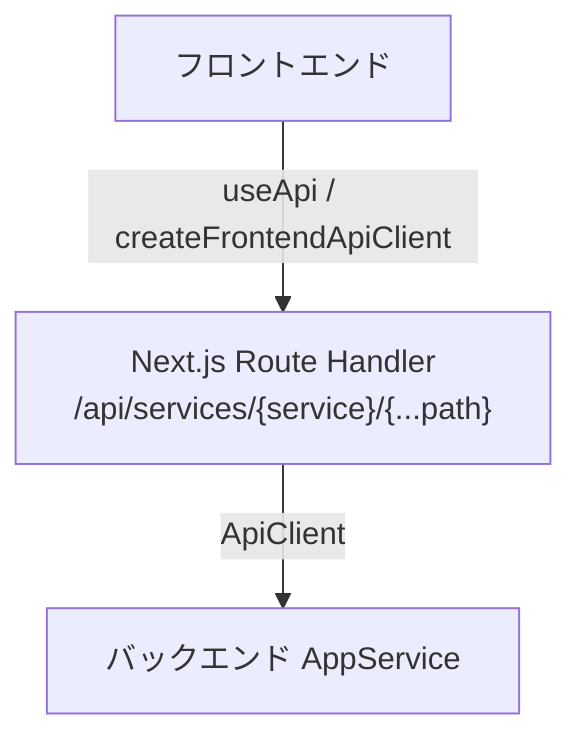

# APIルーティング基盤

## 概要

このドキュメントは、Next.js の proxy / Route Handler を用いた API ルーティング基盤を整理するものです。Issue #97 のポケモンダメージ計算機能では、既存基盤を拡張せずに `pokemon-damage-calculator-api` を feature-local に利用する方針を採用しています。

| 項目 | 内容 |
|------|------|
| proxy 入口 | `/api/services/{service}/{...path}` |
| フロントエンド呼び出し | `createFrontendApiClient(serviceName)` |
| 認証伝搬 | `Authorization` と `X-Google-Access-Token` |
| 匿名アクセス | `pokemon-damage-calculator-api` 向け GET allowlist を実装 |
| Issue #97 の feature route | `/pokemon-damage-calculator`, `/pokemon-damage-calculator/runs/[runId]` |
| ドキュメント状態 | Phase 3 の実装反映済み |

## 開発・認証の前提

- 本プロジェクトの実行・検証手順は Docker Compose ベースを前提とします。
- 認証は Google OAuth2（NextAuth）を使用し、セッション情報に基づくアクセス制御を行います。
- API リクエストには Google 認証アクセストークンを含める方針です。
  - フロントエンド API クライアントは `X-Google-Access-Token` ヘッダーにトークンを付与します。
  - API クライアントや Route Handler を変更する場合は、トークンの受け渡し・付与・検証の整合性を維持してください。
- 実装は Next.js の標準機能（App Router / Route Handlers / Server Components）を優先します。
- UI 実装はコンポーネント指向で行い、既存の階層（atoms / molecules / organisms）と整合させてください。

### 主な特徴

- 複数 API サービスへの統一的なアクセス
- フロントエンドから Next.js API Routes 経由でバックエンド API にアクセスする proxy パターン
- TypeScript による型安全な実装
- `useApi` / `createFrontendApiClient` による利用
- 追加サービスを環境変数で拡張可能

## アーキテクチャ



## ポケモンダメージ計算機能の実装

本機能では、既存の `game-management` から画面状態やレイアウトを流用せず、feature-local の UI / state / DTO 変換を採用しています。

| 項目 | 実装内容 |
|------|----------|
| feature entry | `/pokemon-damage-calculator` |
| Run workspace | `/pokemon-damage-calculator/runs/[runId]` |
| 利用サービス名 | `pokemon-damage-calculator-api` |
| フロントエンド API 呼び出し | `createFrontendApiClient("pokemon-damage-calculator-api")` |
| Route Handler | 既存の `/api/services/[service]/[...path]` を継続利用 |

### 匿名 GET allowlist

ポケモンダメージ計算 API には匿名参照を許可する GET エンドポイントが含まれるため、本機能では既存 proxy の認証モデルを壊さず、許可対象 GET パスのみ匿名通過できる allowlist を実装しています。

実装済みの匿名許可 GET 一覧は以下です。

| 区分 | 想定する proxy パス | 用途 |
|------|----------------------|------|
| RuleSet 一覧 | `GET /api/services/pokemon-damage-calculator-api/api/rule-sets` | feature entry の初期表示 |
| Run 一覧 | `GET /api/services/pokemon-damage-calculator-api/api/runs` | feature entry の一覧表示 |
| Run 詳細 | `GET /api/services/pokemon-damage-calculator-api/api/runs/{runId}` | workspace 初期表示 |
| Battle 一覧 | `GET /api/services/pokemon-damage-calculator-api/api/runs/{runId}/battles` | workspace の参照データ取得 |
| Party State 参照 | `GET /api/services/pokemon-damage-calculator-api/api/runs/{runId}/party-state` | workspace の状態参照 |

認証必須操作一覧は以下です。

| 区分 | 想定する proxy パス | 方針 |
|------|----------------------|------|
| Run 作成・更新・削除 | `POST /api/services/pokemon-damage-calculator-api/api/runs`、`PUT/DELETE /api/services/pokemon-damage-calculator-api/api/runs/{runId}` | 認証必須 |
| Battle 作成・更新・削除 | `POST /api/services/pokemon-damage-calculator-api/api/runs/{runId}/battles`、`PUT/DELETE /api/services/pokemon-damage-calculator-api/api/runs/{runId}/battles/{id}` | 認証必須 |
| Party State 進行イベント追加 | `POST /api/services/pokemon-damage-calculator-api/api/runs/{runId}/party-state` | 認証必須 |
| Damage Calculation 実行 | `POST /api/services/pokemon-damage-calculator-api/api/runs/{runId}/battles/{id}/calculate` | 認証必須 |

補足:

- `pokemon-damage-calculator-api` の匿名 GET パスを明示的に列挙する
- allowlist 対象外は従来どおり認証必須とする
- 計算結果は `POST /api/runs/{runId}/battles/{id}/calculate` のレスポンスとして取得し、`GET /api/runs/{runId}/calculations` や calculations 配下の CRUD は契約に含めない
- Route Handler / middleware の双方で整合した判定を維持する
- 判定ロジックは `lib/pokemon-damage-calculator/proxy-policy.ts` に集約し、`proxy.ts` と `app/api/services/[service]/[...path]/route.ts` で共有する

### 認証ヘッダー伝搬

認証が必要なリクエストでは、既存実装と同様に以下 2 ヘッダーの伝搬を維持しています。

| ヘッダー | 用途 |
|----------|------|
| `Authorization: Bearer <token>` | 一般的な bearer token 伝搬 |
| `X-Google-Access-Token: <token>` | Google 連携を前提としたバックエンド処理向け |

`createFrontendApiClient` と proxy Route Handler の両方で同じ方針を維持し、片側のみ変更される状態を避けます。Route Handler では `buildGoogleProxyHeaders` を通して、`session.accessToken` を優先し、未取得時のみ受信済み `Authorization` / `X-Google-Access-Token` をフォールバック利用します。

## 設定

### 環境変数

`.env.local` または Docker 用の `.env.docker.*` ファイルで、デフォルト API と追加 API の URL を設定します。

```bash
# アプリ全体の既定 API
NEXT_PUBLIC_API_BASE_URL=http://localhost:8000

# 業務機能 API の例: ゲームライブラリ管理
API_SERVICES=game-library-api
API_SERVICE_GAME_LIBRARY_API_BASE_URL=http://localhost:10080
API_SERVICE_GAME_LIBRARY_API_KEY=your-game-library-api-key-here

# 既存の固定サービス
API_SERVICE_1_BASE_URL=http://localhost:8001
API_SERVICE_1_API_KEY=your-api-key-here
API_SERVICE_2_BASE_URL=http://localhost:8002
API_SERVICE_2_API_KEY=your-api-key-here
API_SERVICE_3_BASE_URL=http://localhost:8003
API_SERVICE_3_API_KEY=your-api-key-here

# 将来追加するサービス
API_SERVICES=inventory-api,reporting-api
API_SERVICE_INVENTORY_API_BASE_URL=http://localhost:8011
API_SERVICE_INVENTORY_API_KEY=your-inventory-api-key-here
API_SERVICE_REPORTING_API_BASE_URL=http://localhost:8012
API_SERVICE_REPORTING_API_KEY=your-reporting-api-key-here

# Pokemon Damage Calculator API
API_SERVICES=inventory-api,reporting-api,pokemon-damage-calculator-api
API_SERVICE_POKEMON_DAMAGE_CALCULATOR_API_BASE_URL=http://localhost:<pokemon-damage-calculator-api-port>
```

補足:

- `NEXT_PUBLIC_API_BASE_URL` は共通の既定値です。
- 業務機能 API は `game-library-api` のように、画面名より業務ドメインが分かる名前を付けます。
- `API_SERVICES` に列挙したサービスは `createFrontendApiClient("inventory-api")` のように直接使えます。
- `API_SERVICE_<サービス名>_BASE_URL` のサービス名部分は、ハイフンなどを `_` に変換し大文字化して指定します。

ポケモンダメージ計算機能では、`pokemon-damage-calculator-api` を上記ルールに従って登録します。`lib/config/api-config.ts` では組み込みサービスとして `API_SERVICE_POKEMON_DAMAGE_CALCULATOR_API_BASE_URL` と任意の `API_SERVICE_POKEMON_DAMAGE_CALCULATOR_API_KEY` を参照します。

## 使用方法

### 1. Reactコンポーネントでの使用

最も簡単な方法は `useApi` フックを使用することです：

```tsx
"use client";

import { useApi } from "@/lib/hooks/useApi";

export default function UsersPage() {
  // 静的なエンドポイントの場合、requestFnをコンポーネント外で定義可能
  const { data, error, loading, execute } = useApi(
    "service1",
    (client) => client.get("/users"), // 静的な場合はこれでOK
  );

  const handleLoadUsers = async () => {
    await execute();
  };

  return (
    <div>
      <button onClick={handleLoadUsers} disabled={loading}>
        ユーザー一覧を取得
      </button>

      {loading && <p>読み込み中...</p>}
      {error && <p>エラー: {error}</p>}
      {data && <pre>{JSON.stringify(data, null, 2)}</pre>}
    </div>
  );
}
```

**動的なパラメータを使用する場合:**

```tsx
"use client";

import { useState, useCallback } from "react";
import { useApi } from "@/lib/hooks/useApi";

export default function DynamicUsersPage() {
  const [userId, setUserId] = useState("1");

  // 動的なパラメータを含む場合は useCallback でメモ化
  const requestFn = useCallback(
    (client) => client.get(`/users/${userId}`),
    [userId], // userId が変更されたときのみ再作成
  );

  const { data, error, loading, execute } = useApi("service1", requestFn);

  const handleLoadUser = async () => {
    await execute();
  };

  return (
    <div>
      <input
        value={userId}
        onChange={(e) => setUserId(e.target.value)}
        placeholder="User ID"
      />
      <button onClick={handleLoadUser} disabled={loading}>
        ユーザーを取得
      </button>

      {loading && <p>読み込み中...</p>}
      {error && <p>エラー: {error}</p>}
      {data && <pre>{JSON.stringify(data, null, 2)}</pre>}
    </div>
  );
}
```

### 2. クライアント側で直接APIクライアントを使用

```tsx
"use client";

import { createFrontendApiClient } from "@/lib/api/frontend-client";

async function fetchUsers() {
  const client = createFrontendApiClient("service1");
  const response = await client.get("/users");

  if (response.success) {
    console.log("Users:", response.data);
  } else {
    console.error("Error:", response.error);
  }
}
```

### 3. サーバーサイド（Server Components/API Routes）での使用

```tsx
import { getApiClient } from "@/lib/api/client-factory";

export async function GET() {
  const client = getApiClient("service1");
  const response = await client.get("/users");

  if (response.success) {
    return Response.json(response.data);
  } else {
    return Response.json({ error: response.error.message }, { status: 500 });
  }
}
```

## API エンドポイント

### プロキシエンドポイント

すべてのAppServiceへのリクエストは以下のパターンでアクセスします：

```
/api/services/{service}/{...path}
```

**パラメータ:**

- `{service}`: サービス名（`service1`, `service2`, `service3`, または `API_SERVICES` に追加した任意名）
- `{...path}`: AppServiceのエンドポイントパス

**サポートされるHTTPメソッド:**

- GET
- POST
- PUT
- PATCH
- DELETE

### 例

```bash
# game-library-api の /api/Accounts にアクセス
GET /api/services/game-library-api/api/Accounts

# Service1の /users エンドポイントにアクセス
GET /api/services/service1/users

# Service2の /posts エンドポイントにデータをPOST
POST /api/services/service2/posts
Content-Type: application/json
{
  "title": "New Post",
  "content": "Post content"
}

# Service3の /items/123 を取得
GET /api/services/service3/items/123

# ポケモンダメージ計算 API の runs を取得
GET /api/services/pokemon-damage-calculator-api/api/runs
```

### Issue #97 で想定する利用例

| 画面 | 想定する proxy 呼び出し |
|------|-------------------------|
| `/pokemon-damage-calculator` | RuleSet 一覧、Run 一覧の GET |
| `/pokemon-damage-calculator/runs/[runId]` | Run 詳細、Battle 一覧、Party State の GET、Battle CRUD、Party State 追加、ダメージ計算 POST |

## 新しいサービスの追加

1. `.env.local` または `.env.docker.*` にサービス名を追加

```bash
API_SERVICES=inventory-api,reporting-api
API_SERVICE_INVENTORY_API_BASE_URL=http://localhost:8011
API_SERVICE_REPORTING_API_BASE_URL=http://localhost:8012
```

2. 必要なら API キーも追加

```bash
API_SERVICE_INVENTORY_API_KEY=your-inventory-api-key-here
API_SERVICE_REPORTING_API_KEY=your-reporting-api-key-here
```

3. フロントエンドまたは Route Handler からそのまま使用

```tsx
const client = createFrontendApiClient("inventory-api");
const response = await client.get("/endpoint");
```

この方式なら、サービス追加のたびに `lib/config/api-config.ts` を編集しなくても済みます。

ポケモンダメージ計算機能でも同じ拡張方式を利用し、サービス追加のための feature 固有分岐は増やしていません。

## ディレクトリ構造

```
/app/api/services/[service]/[...path]
  └── route.ts                      # プロキシAPIルート

/lib
  ├── api
  │   ├── api-client.ts            # バックエンドAPIクライアント
  │   ├── client-factory.ts        # クライアントファクトリー
  │   ├── frontend-client.ts       # フロントエンド用クライアント
  │   └── route-helpers.ts         # API Routes用ヘルパー
  ├── config
  │   └── api-config.ts            # API設定
  ├── hooks
  │   └── useApi.ts                # React API フック
  └── types
      └── api.ts                   # 型定義
```

## エラーハンドリング

すべてのAPIレスポンスは以下の形式に統一されています：

### 成功レスポンス

```typescript
{
  success: true,
  data: T,
  message?: string
}
```

### エラーレスポンス

```typescript
{
  success: false,
  error: {
    code: string,
    message: string,
    details?: unknown
  }
}
```

### エラーコード

- `INVALID_SERVICE`: 無効なサービス名
- `METHOD_NOT_ALLOWED`: サポートされていないHTTPメソッド
- `TIMEOUT`: リクエストタイムアウト
- `NETWORK_ERROR`: ネットワークエラー
- `HTTP_{status}`: HTTPステータスコードエラー
- `INTERNAL_ERROR`: 内部エラー

## ベストプラクティス

1. **環境変数の管理**: `.env.local` を使用し、本番環境では適切に設定
2. **エラーハンドリング**: すべてのAPIコールで `success` フラグをチェック
3. **型定義**: レスポンスの型を明示的に定義
4. **タイムアウト**: 長時間かかる可能性がある処理には適切なタイムアウトを設定
5. **キャッシング**: 必要に応じてSWRやReact Queryなどと組み合わせる
6. **認証トークン運用**: 認証が必要な通信では Google アクセストークンを付与し、ヘッダー処理の不整合を作らない

### ⚠️ 重要: useApi フックの正しい使用方法

`useApi` フックを使用する際は、**requestFn を必ず `useCallback` でメモ化してください**。これを怠ると、無限再レンダリングやスタックオーバーフローが発生する可能性があります。

**❌ 悪い例（スタックオーバーフローの原因）:**

```tsx
// endpoint が変更されるたびに新しい関数が作成される
const { data, error, loading, execute } = useApi(
  "service1",
  (client) => client.get(endpoint), // 危険！
);
```

**✅ 良い例:**

```tsx
import { useCallback } from "react";

// requestFn を useCallback でメモ化
const requestFn = useCallback(
  (client) => client.get(endpoint),
  [endpoint], // endpoint が変更されたときのみ再作成
);

const { data, error, loading, execute } = useApi("service1", requestFn);
```

**詳細な説明:**

- `useApi` の第2引数（`requestFn`）は、React の `useCallback` の依存配列に含まれています
- インライン関数を使用すると、コンポーネントが再レンダリングされるたびに新しい関数が作成されます
- これにより、`useApi` 内部の `useCallback` が毎回再実行され、無限ループが発生します
- 必ず `useCallback` または `useMemo` でメモ化してください

詳細は [カーネルスタックオーバーフロー調査レポート](./KERNEL_STACK_OVERFLOW_INVESTIGATION.md) を参照してください。

## サンプルコード

完全な使用例は `/app/api-example` ページを参照してください。

## トラブルシューティング

### CORS エラー

Next.js API Routesを経由することでCORSの問題を回避できます。

### タイムアウトエラー

デフォルトのタイムアウトは60秒です。Azure Container Apps の scale-to-zero 復帰時に発生するコールドスタートを吸収できる値にしており、長時間かかる処理では必要に応じて個別指定で調整してください。

### 環境変数が反映されない

開発サーバーを再起動してください：

```bash
npm run dev
```

## まとめ

この API ルーティング基盤により、複数の AppService へのアクセスを統一的かつ型安全に実現できます。Issue #97 では、この既存基盤を維持しながら `pokemon-damage-calculator-api` の追加、匿名 GET allowlist の明確化、認証ヘッダー 2 系統の維持、`googleUserId` に基づく owner-only 更新制御を実装しました。
